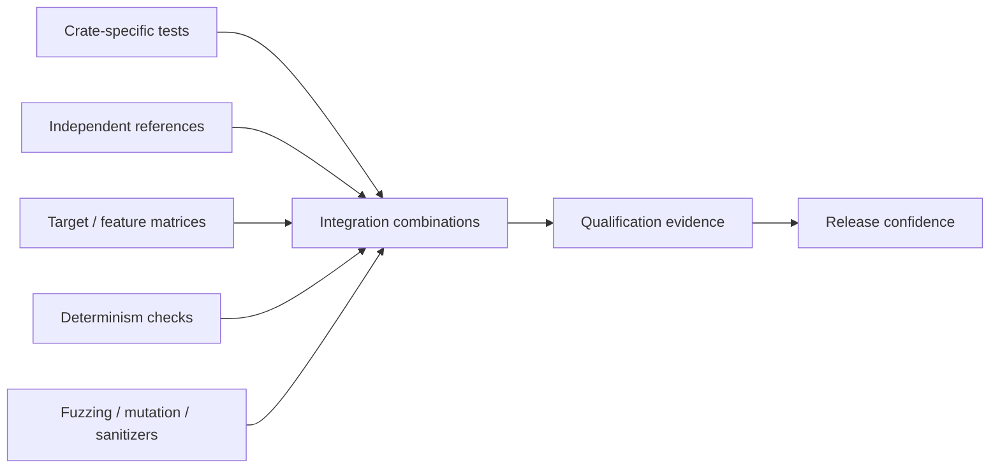

<div align="center">

# Perfect Qualification

### Cross-family verification, compatibility, determinism, and release assurance for Perfect Foundations.


</div>

---

## Why this repository exists

A crate can pass every one of its own tests and still fail when composed with neighboring crates.

Perfect Qualification exists to answer the harder question:

> **Do supported combinations of Perfect-family crates continue to satisfy the shared family contract together?**

This repository therefore owns **integration evidence**, not production algorithms.

No production Perfect crate should depend on `perfect-qualification`.

---

## Qualification model



---

## What gets qualified

### 🔗 Compatibility

- Cross-crate API and version compatibility.
- Dependency-DAG and layering rules.
- Optional-feature combinations.
- Canonical representations across crate boundaries.
- Numeric conversions and precision preservation.
- Units/uncertainty/evidence interoperability where supported.

### 🧱 Build & target coverage

- Declared MSRV.
- Stable toolchain.
- Supported operating systems.
- Supported CPU architectures.
- `no_std` configurations where claimed.
- Feature matrices.
- Optional accelerators/adapters without contaminating portable cores.

### 🎯 Determinism & reproducibility

- Repeated-run equivalence where promised.
- Seeded stochastic reproducibility.
- Canonical-byte stability.
- Order-invariance where explicitly promised.
- Cross-platform consistency within the documented contract.

### 🧪 Robustness

- Integration fuzzing.
- Mutation testing where valuable.
- Sanitizers and Miri where applicable.
- Malformed-input behavior.
- Boundary/degenerate-case behavior.
- Foreign-interface failure isolation.

### 📐 External reference evidence

- Known-answer vectors.
- Independent reference generators.
- Published standards datasets.
- Differential tests against mature external implementations.
- Numerical error analysis.
- Historical dataset regression where standards evolve.

---

## Qualification gates

| Gate | Name | Purpose |
|---|---|---|
| **Q0** | Repository integrity | Revision, source state, dependency inventory, declared targets/features |
| **Q1** | Build matrix | MSRV, stable, OS/arch, `no_std`, feature combinations |
| **Q2** | Semantic integration | Cross-crate conversions, exactness, rounding, units, uncertainty, canonical bytes |
| **Q3** | Reproducibility | Deterministic outputs, seeded stochastic behavior, byte stability |
| **Q4** | Robustness | Fuzzing, mutation, sanitizers/Miri, malformed inputs |
| **Q5** | External reference | Known-answer vectors, standards, independent implementations |
| **Q6** | Release candidate | Full matrix, docs, FFI/dependency review, performance/evidence bundle |

Not every test class applies to every crate. Qualification is **domain-specific but systematically recorded**.

---

## Evidence principle

A passing crate test suite demonstrates:

> **The crate satisfies the tested parts of its own contract.**

A passing Perfect Qualification run demonstrates:

> **The tested supported combination satisfies the cross-family integration contract.**

Neither statement should be inflated into claims that were not actually tested.

---

## Planned repository structure

```text
perfect-qualification/
├── qualification/   # plans, matrices, gates
├── vectors/         # cross-crate known-answer/reference vectors
├── fixtures/        # integration fixtures and datasets
├── scripts/         # deterministic qualification runners
└── reports/         # retained/generated evidence where appropriate
```

---

## Release philosophy

Qualification is not a ceremony added at the end.

The family should be designed so that:

1. each crate defines what must remain true;
2. those truths can be tested independently;
3. integration boundaries can be exercised deterministically;
4. release evidence can be regenerated;
5. changes that invalidate assumptions become visible early.

---

## Design dossier

The README is the front door. The detailed implementation starting point is the **[Project Blueprint](docs/PROJECT-BLUEPRINT.md)**.

That blueprint records the project's expected core abstractions, functional requirements, algorithm families, semantic/error model, API principles, feature and dependency strategy, platform targets, Linux distribution/offline-build requirements, supply-chain policy, verification oracles, benchmark plan, key risks, milestones, and the evidence required before this crate can be considered **default-grade infrastructure**.

Family-wide requirements also apply:

- [Adoption Standard](https://github.com/Perfect-Foundations/perfect-family/blob/main/docs/ADOPTION-STANDARD.md)
- [Linux Distribution Readiness](https://github.com/Perfect-Foundations/perfect-family/blob/main/docs/DISTRO-READINESS.md)
- [API & Semantic Stability](https://github.com/Perfect-Foundations/perfect-family/blob/main/docs/API-STABILITY.md)
- [Release Quality Gates](https://github.com/Perfect-Foundations/perfect-family/blob/main/docs/RELEASE-QUALITY-GATES.md)
- [Supply-Chain & Build Security](https://github.com/Perfect-Foundations/perfect-family/blob/main/docs/SUPPLY-CHAIN-SECURITY.md)

> **Adoption ambition:** become a credible default foundational choice for Rust applications and Linux distribution packaging. This is a quality target to earn through evidence, not a claim of current endorsement by the Rust project or any Linux distribution.

## Related

- 🗺️ [Perfect Family architecture](https://github.com/Perfect-Foundations/perfect-family)
- 🏠 [Perfect Foundations organization](https://github.com/Perfect-Foundations)
- 📋 [Perfect Family Project](https://github.com/orgs/Perfect-Foundations/projects/1)
- 📄 [Qualification Plan](QUALIFICATION-PLAN.md)

---

<div align="center">

### A family is only as strong as the contracts between its parts.

</div>
